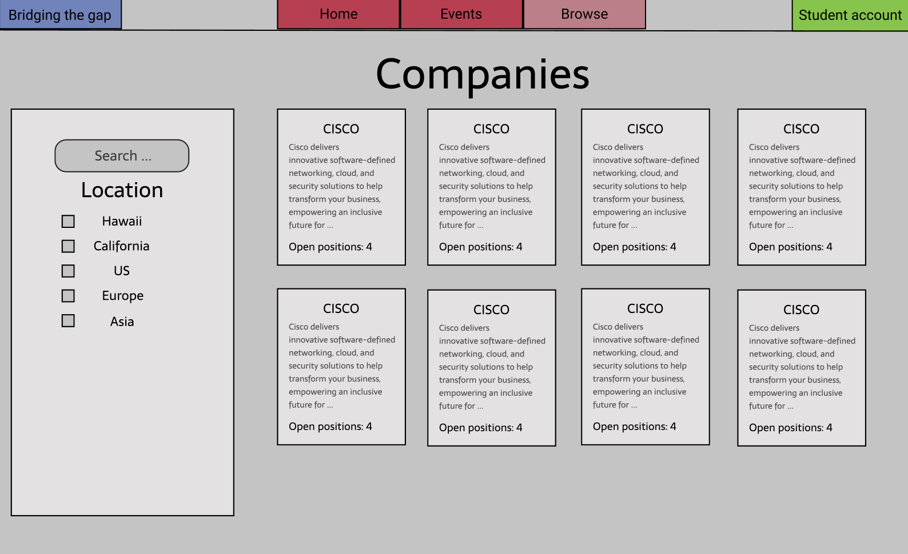
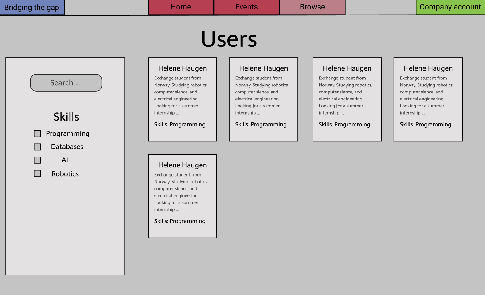
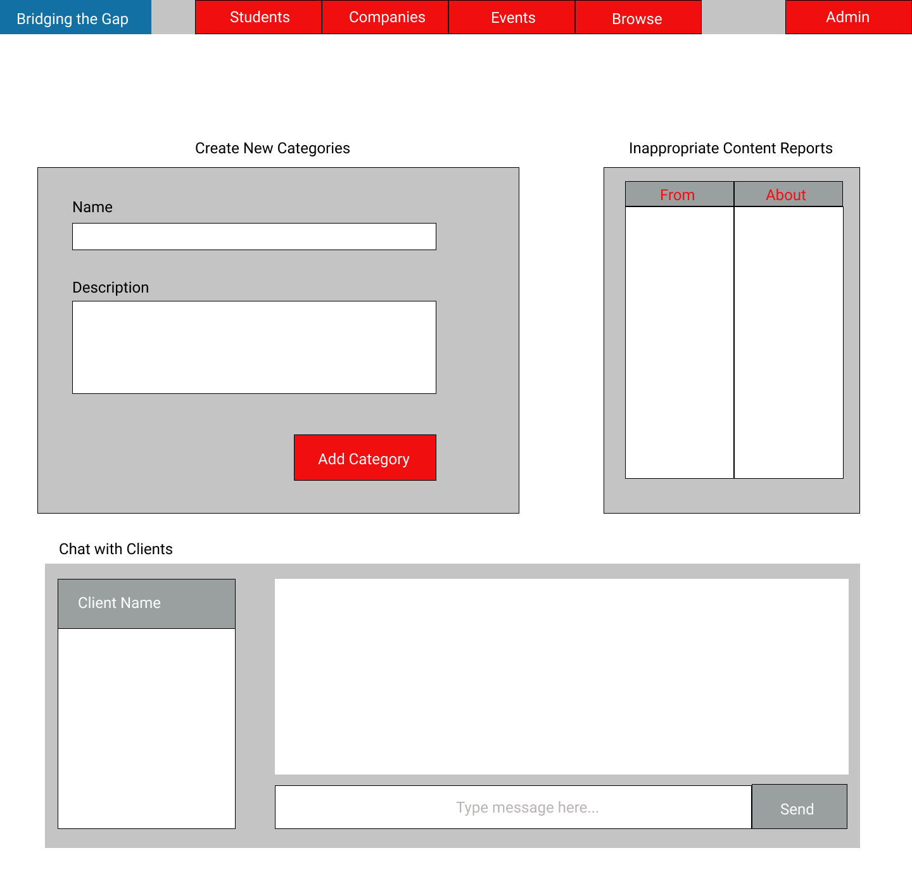

## Bridging the Gap

* [Overview](#overview)
* [Approach](#approach)
* [Team](#team)
* [User Guide](#User-Guide)

## Overview

The problem: Many UH computer science and engineering students want to learn about internship and job opportunities, but currently they must wait until a company decides to visit the campus or send out some sort of announcement. There is no efficient way for students to understand the “landscape” of internship and job opportunities that might be available in the future, so they can prepare for them now.

The solution: The Bridging the Gap web application provides a new way for local and non-local companies who want to recruit students from UH to make their (potential) opportunities known to students. At the same time, students can create profiles on the site with their interests. The site can match students to employers and vice-versa.

## Approach

Instead of sending out announcements each year, a company can create a page in the site that lists:

A brief overview of the company.
Geographic location of the company.
A list of positions that they commonly recruit for from new UH graduates. Each position has a brief description, a set of skills, whether it’s an internship, permanent position, or both, how many people they would like to hire, and salary range.
Links to pages for additional information.
Contact email(s) for followup.
Students who visit the site can create a profile with their interests (skills), preferred geographic location, and link to their professional portfolio page.

Admins can monitor the site for inappropriate content, and create new categories of musical tastes, capabilities, and goals.

Some mockup pages include:

* Landing page
* Student home page.
* Company home page
* Admin home page
* Student profile page.
* Company profile page
* Browse companiesby by geographic preference etc.
* Browse users by skill etc.

## Team

Bridging the Gap is designed, implemented, and maintained by 
* [Nina Nyegaarden](https://ninanye.github.io/) 
* [Helene Haugen](https://heleeha.github.io/) 
* [Marte Aaberge](https://martkaa.github.io/) 
* [Leilani Reich](https://leilani-reich.github.io/)
* [Bryan Yagi](https://bryanyagi.github.io/).

## User Guide

### Landing Page

The landing page is the page everyone sees when they first enter the site. It introduces Bridging the Gap and its purpose and describes how to register. There is also a place to leave feedback on the site.

### Company Homepage

The company homepage allows companies to create their own profile on this site.
They are able to leave a short description of their company, where they are located, 
what industries they are interested in and an email by which they can be contacted.
From here, companies are also able to create job listings; the job title, 
the location of this job, it's salary range, the type of job (part-time, full-time, internship), 
how many opennings and a short description of the job's responsibilities.

### Company Profile Page

The company profile page will display all of the company's details and the jobs that are available for said company.
The company can also choose to add a background picture to customize their page.

### Browse companies

The browse company page will display all companies by geographic preference. Students will be able to see this page.

### Browse users

The browse company page will display all student users by skill preference. Companies will be able to see this page.

### Admin Homepage

The admin homepage allows admins to make new categories, monitor innappropriate content, and chat with clients who may be having problems.

### Events
The event page will display all upcoming events arranged by companies for UH Students only. This involves career-fairs, presentations and dinners with potential employers. 

