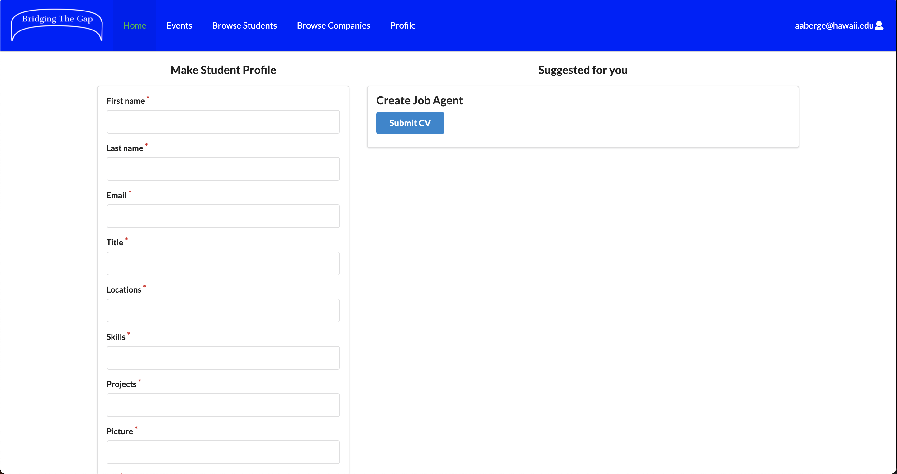

## Bridging the Gap

* [Overview](#overview)
* [Deployment](#deployment)
* [User Guide](#user-guide)
* [Community Feedback](#community-feedback)
* [Developer Guide](#developer-guide)
* [Development History](#development-history)
* [Team](#team)

## Overview

The problem: Many UH computer science and engineering students want to learn about internship and job opportunities, but currently they must wait until a company decides to visit the campus or send out some sort of announcement. There is no efficient way for students to understand the “landscape” of internship and job opportunities that might be available in the future, so they can prepare for them now.

The solution: The Bridging the Gap web application provides a new way for local and non-local companies who want to recruit students from UH to make their (potential) opportunities known to students. At the same time, students can create profiles on the site with their interests. The site can match students to employers and vice-versa.

Here is a link to the [GitHub organization](https://github.com/bridging-the-gap) for this project and its repositories.

Our first project board, M1, can be found [here](https://github.com/bridging-the-gap/bridging-the-gap/projects/1).

Our second project board, M2, can be found [here](https://github.com/bridging-the-gap/bridging-the-gap/projects/2).

Our third project board, M3, can be found [here](https://github.com/bridging-the-gap/bridging-the-gap/projects/3).

### Approach

Instead of sending out announcements each year, a company can create a page in the site that lists:

A brief overview of the company.
Geographic location of the company.
A list of positions that they commonly recruit for from new UH graduates. Each position has a brief description, a set of skills, whether it’s an internship, permanent position, or both, how many people they would like to hire, and salary range.
Links to pages for additional information.
Contact email(s) for followup.
Students who visit the site can create a profile with their interests (skills), preferred geographic location, and link to their professional portfolio page.

Admins can monitor the site for inappropriate content, and create new categories of musical tastes, capabilities, and goals.

Some mockup pages include:

* Landing page
* Student home page.
* Company home page
* Admin home page
* Student profile page.
* Company profile page
* Browse companies by by geographic preference etc.
* Browse students by skill etc.
* Events

## Deployment
The latest version of the app is hosted [here](https://bridging-the-gap.xyz/#/).

#### Log-in credentials for a home-page mockup for companies using the app: 
Email: google@google.com

Password: foo

#### Log-in credentials for a home-page mockup for students using the app: 
Email: henric@hawaii.edu

Password: foo

#### Log-in credentials for a home-page mockup for admin using the app: 
Email: cmoore@hawaii.edu

Password: foo

## User Guide

### Landing Page

The landing page is the page everyone sees when they first enter the site. It introduces Bridging the Gap and its purpose and describes how to register. There is also a place to leave feedback on the site.


### Sign in

To login, use the sign in page. Click on the “Login” button in the upper right corner of the navbar, then select “Sign in” to go to the following page and login. You must have been previously registered with the system to use this option:


### Sign up

To register, use the sign up page, also accessible from the dropdown in the top right of the navbar. Once reaching the signup page, you have the same fields as the sign in page plus you must also specify your role as either student or company.


### Company Homepage

After creating an account or logging in, if your account is specified as a company, you will be redirected here.
The company homepage allows companies to edit their own profile and add job listings.
The company information will be displayed on the left side of the screen, while the active job listings will be shown on the right side. Active events are also displayed below the active job listings. From there you can browse any active events, sign up to attend or create an event of your own.


### Company Profile Page

The company profile page will display all of the company's details and the jobs that are available for said company.


### Browse Companies

The browse company page display all companies by geographic preference. Currently all logged in users can view this page.


### Student Homepage

This page will let the student have an overview over events and job applications.



### Student Profile Page

This page will allow the student to add resume and job experience.


###Edit Student Profile Page

Students will be able to edit their profiles via this page.


### Browse Students

The browse students page displays all students by skill preference. Currently all logged in users can view this page.


### Admin Homepage

The admin homepage allows admins to make new categories, monitor innappropriate content, and chat with clients who may be having problems. Right now, the admin will receive reports made from clients regarding inappropriate content, as shown in the table. The admin can delete old and irrelevant reports as needed by clicking the "X" button. Based on reports, the admin can also delete the accounts of users who seem to be causing trouble. In addition, the admin can send individual messages to clients that will be sent to their email.


### Add Reports

The add reports page enables any user to add a report regarding inappropriate content on the site. As shown, this page is accessible in the dropdown in the top right of the navbar. Once a report is created and submitted, this information is sent straight to the admin for review.


### Events

The event page will display all upcoming events arranged by companies for UH Students only. This involves career-fairs, presentations and dinners with potential employers. 


## Community Feedback

Questions:
* How do you like the design/layout of the website?
* Does everything function correctly?
* Did you come accross any bugs?
* What improvements/additions could be made?
* Do you think our website would be useful to the UH community?
* Does the data we’ve provided seem realistic?
* On a scale of 1 to 10, how would you rate our website?

#### Community Member: Andrew
##### How do you like the design/layout of the website?
  I like it, it's nice and simple. 
##### Does everything function correctly?
  Seems like it.
##### Did you come accross any bugs?
  No
##### What improvements/additions could be made?
  Maybe add a bit more design to the webpages. It still seems a little rough.
##### Do you think our website would be useful to the UH community?
  Yes, if you can get companies to use this website, it should be a very useful tool for the community
##### Does the data we’ve provided seem realistic?
  Yes
##### On a scale of 1 to 10, how would you rate our website?
  8 


## Developer Guide

This section provides information of interest to Meteor developers wishing to use this code base as a basis for their own development tasks.

### Installation

First, [install Meteor](https://www.meteor.com/install).

Second, visit the [Bridging the Gap application github page](https://github.com/bowfolios/bowfolios), and click the "Use this template" button to create your own repository initialized with a copy of this application. Alternatively, you can download the sources as a zip file or make a fork of the repo.  However you do it, download a copy of the repo to your local computer.

Third, cd into the bridging-the-gap/app directory and install libraries with:

```
$ meteor npm install
```

Fourth, run the system with:

```
$ meteor npm run start
```

If all goes well, the application will appear at [http://localhost:3000](http://localhost:3000).

## Development History

The development process for Bridging the Gap conformed to [Issue Driven Project Management](http://courses.ics.hawaii.edu/ics314f19/modules/project-management/) practices. In a nutshell:

* Development consists of a sequence of Milestones.
* Each Milestone is specified as a set of tasks.
* Each task is described using a GitHub Issue, and is assigned to a single developer to complete.
* Tasks should typically consist of work that can be completed in 2-4 days.
* The work for each task is accomplished with a git branch named "issue-XX", where XX is replaced by the issue number.
* When a task is complete, its corresponding issue is closed and its corresponding git branch is merged into master.
* The state (todo, in progress, complete) of each task for a milestone is managed using a GitHub Project Board.

The following sections document the development history of Bridging the Gap.

### Milestone 1: Mockup development

The goal of Milestone 1 was to create a set of HTML pages using semantic ui react, which provide a mockup of the pages in the system.

Milestone 1 was managed using [Bridging the Gap GitHub Project Board M1](https://github.com/bridging-the-gap/bridging-the-gap/projects/1)

### Milestone 2: Data model development & testing

The goal of Milestone 2 was to implement the data model: the underlying set of Mongo Collections and the operations upon them that will support the Bridging the Gap application. In addition, we added more pages, improved on the overall functionality and completeness of the system, added testcafe acceptance tests, and put our system under continuous integration.

Milestone 2 was managed using [Bridging the Gap GitHub Project Board M2](https://github.com/bridging-the-gap/bridging-the-gap/projects/2)

### Milestone 3: Real data and finalizing functionality

The goal of Milestone 3 is to finish implementing the functionality of all our pages. In addition, we aim to add substantial amounts of real data to all of our collections in the system. Afterward, we will get community feedback and finalize testing on our site to ensure it is the best it can be.

Milestone 3 is managed using [Bridging the Gap GitHub Project Board M3](https://github.com/bridging-the-gap/bridging-the-gap/projects/3)

## Team

Bridging the Gap is designed, implemented, and maintained by 
* [Nina Nyegaarden](https://ninanye.github.io/) 
* [Helene Haugen](https://heleeha.github.io/) 
* [Marte Aaberge](https://martkaa.github.io/) 
* [Leilani Reich](https://leilani-reich.github.io/)
* [Bryan Yagi](https://bryanyagi.github.io/)


