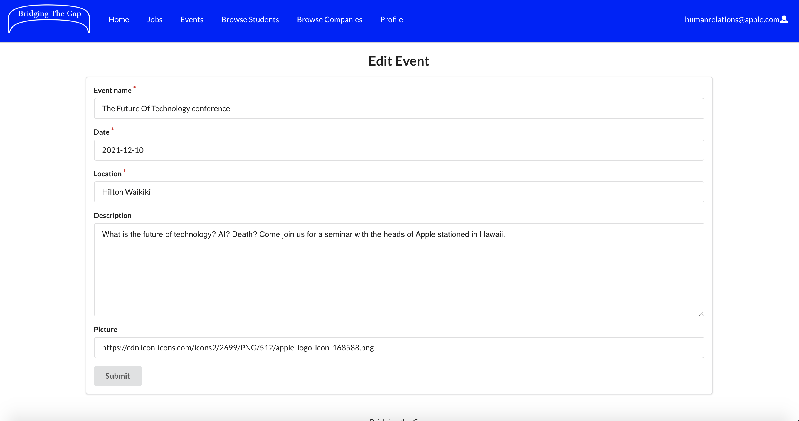

## Bridging the Gap


* [Overview](#overview)
* [Deployment](#deployment)
* [User Guide](#user-guide)
* [Community Feedback](#community-feedback)
* [Developer Guide](#developer-guide)
* [Development History](#development-history)
* [Team](#team)
* [Contact Us](#contact-us)

## Overview

The problem: Many UH computer science and engineering students want to learn about internship and job opportunities, but currently they must wait until a company decides to visit the campus or send out some sort of announcement. There is no efficient way for students to understand the “landscape” of internship and job opportunities that might be available in the future, so they can prepare for them now.

The solution: The Bridging the Gap web application provides a new way for local and non-local companies who want to recruit students from UH to make their (potential) opportunities known to students. At the same time, students can create profiles on the site with their interests. The site can match students to employers and vice-versa.

Here is a link to the [GitHub organization](https://github.com/bridging-the-gap) for this project and its repositories.

Our first project board, M1, can be found [here](https://github.com/bridging-the-gap/bridging-the-gap/projects/1).

Our second project board, M2, can be found [here](https://github.com/bridging-the-gap/bridging-the-gap/projects/2).

Our third project board, M3, can be found [here](https://github.com/bridging-the-gap/bridging-the-gap/projects/3).

### Approach

Instead of sending out announcements each year, a company can create a page in the site that lists:

A brief overview of the company.
Geographic location of the company.
A list of positions that they commonly recruit for from new UH graduates. Each position has a brief description, a set of skills, whether it’s an internship, permanent position, or both, how many people they would like to hire, and salary range.
Links to pages for additional information.
Contact email(s) for followup.
Students who visit the site can create a profile with their interests (skills), preferred geographic location, and link to their professional portfolio page.

Admins can monitor the site for inappropriate content, and create new categories of musical tastes, capabilities, and goals.

Some mockup pages include:

* Landing page
* Student home page.
* Company home page
* Admin home page
* Student profile page.
* Company profile page
* Browse companies by by geographic preference etc.
* Browse students by skill etc.
* Events

## Deployment
The latest version of the app is hosted [here](https://bridging-the-gap.xyz/#/).

#### Log-in credentials for a home-page mockup for companies using the app: 
Email: hr@google.com

Password: foo

#### Log-in credentials for a home-page mockup for students using the app: 
Email: erish@hawaii.edu

Password: foo

#### Log-in credentials for a home-page mockup for admin using the app: 
Email: bridging.the.gap.uhm@gmail.com

Password: foo

## User Guide

### Landing Page

The landing page is the page everyone sees when they first enter the site. It introduces Bridging the Gap and its purpose and describes how to register. There is also a section at the bottom to leave feedback on the site, which will get sent to the email bridging.the.gap.uhm@gmail.com.


### Sign in

To login, use the sign in page. Click on the “Login” button in the upper right corner of the navbar, then select “Sign in” to go to the following page and login. You must have been previously registered with the system to use this option:


### Sign up

To register, use the sign up page, also accessible from the dropdown in the top right of the navbar. Once reaching the signup page, you have the same fields as the sign in page plus you must also specify your role as either student or company. Once you do, unique fields will pop up for you to fill out. They differ for student and company roles.


What students see:


What companies see:


### Company Homepage

After creating an account or logging in, if your account is specified as a company, you will be redirected here.
The company homepage allows companies to edit their own profile and add job listings.
The company information will be displayed on the left side of the screen, while the active job listings will be shown on the right side. Active events are also displayed below the active job listings. From there you can browse any active events, sign up to attend or create an event of your own.


A closer look:


### Company Profile Page

The company profile page will display all of the company's details and the jobs that are available for said company.


### Browse Companies

The browse company page display all companies by geographic preference, using fitering. All logged in users can view this page.


### Student Homepage

This page will let the student see events and jobs they've favorited. It starts out empty.


As students favorite jobs and events, their home page will become filled. By clicking the favorite button once more, the events/jobs will become unfavorited and be removed from the student home page.


### Student Profile Page

This page will allow the student to view their profile and access the page to edit it if needed. Clicking the link called "edit" in the bottom left of the profile card takes the student to the edit student profile page.


### Edit Student Profile Page

Students can edit their profiles via this page. They can change almost all fields they added in during signup but they cannot edit their emails.


### Browse Students

The browse students page displays all students by skill preference, using filtering. All logged in users can view this page.


### Admin Homepage

The admin homepage contains a few different functionalities. First off, in the 'Create New Categories' section, the admin can create new categories of either skills or locations by which students and companies can filter by in the BrowseStudents and BrowseCompanies pages respectively. The admin specifies whether they want to add a skill or category by selecting this option under the dropdown with the label 'Type'. In addition, in the 'User Problem Reports' section, the admin receives reports made from clients regarding problems on the website, as shown in the table. These problems may be of type 'bug', 'user abuse', or 'other', and the admin can filter by the type of problem. In addition, the admin can delete old and irrelevant reports as needed by clicking the "X" button. Based on reports, the admin can also delete the accounts of users who seem to be causing trouble in the 'Delete Offending User' section. Finally, in the 'Send Email to Clients' section, the admin can write and send individual messages to clients that will go to their email.


### Add Reports

The add reports page enables any user to add a report regarding a problem on the site. As shown, this page is accessible from the dropdown in the top right of the navbar. In the 'Type' dropdown, the user can choose whether their problem is a bug, user abuse, or other. Then, they can write a description of their problem. Once a report is created and submitted, this information is sent straight to the admin for review.


### Events

The event page will display all upcoming events arranged by companies for UH Students only. This involves career-fairs, presentations and dinners with potential employers. Students can favorite the events they want to attend and they will show up at their home-page. 


### Add Events

Companies can add events by clicking a link from their home page, and filling out this page. 


### Edit Events

Companies can edit events by changing forms like this one. They can get to the edit page by clicking edit underneath the different events on their home page.



### Jobs

The job listing page displays all joblistings that the companies have added. The student have ability to favorite/unfavorite the different jobs. These will then be showed on the student home page. The apply button take you to the original joblisting on the company website, where you get more information about the position.

The job page as it looks for students. Here the second job is favorited, showed with a red heart instead of green:


The job page as it looks for companies and admin:


### Add jobs
Companies can add jobs by clicking a link from their home page, and filling out this page.


### Edit jobs
Companies can edit jobs by changing forms like this one. They can get to the edit page by clicking edit underneath the different job listings on their home page.


## Community Feedback

Questions:
* How do you like the design/layout of the website?
* Does everything function correctly?
* Did you come accross any bugs?
* What improvements/additions could be made?
* Do you think our website would be useful to the UH community?
* Does the data we’ve provided seem realistic?
* On a scale of 1 to 10, how would you rate our website?

### Community Members: Andrew (A), William Reich (WR), Pernille Wingård (PW), Oda Libæk (OL), Kaja Haugstvedt (KH).
#### How do you like the design/layout of the website?
  A: I like it, it's nice and simple. 
  
  WR: I like it but would suggest more graphics be added to engage the user and direct their attention to areas of interest.
  
  PW: It is a bit to simple and rough. I don't like the color, it's too bright. I suggest using softer and more colors. But other than that I like the layout.
  
  OL: The design of the website looks great! However, I would perhaps make the logo more graphic, and change the strong colors to something more soft. 
  
  KH: I think it looks a bit simple, but I like that the logo is shaped like a bridge.
#### Does everything function correctly?
  A, PW, OL, KH: Seems like it.
  
  WR: No
  
#### Did you come across any bugs?
  A, PW, OL, KH: No
  
  WR: The business skill that I entered upon signing up and creating a company account disappeared when I went to look at my profile. (fixed)
  
#### What improvements/additions could be made?
  A, WR, PW: Maybe add a bit more design to the webpages. It still seems a little rough.
  
  WR: There could be more ways companies and users to get in contact like zoom or google pages for meetings.
  
  PW: The student profile page does not look finished as the edit button is placed in a weird place. (fixed)

Also the difference between company home page and company profile page is not clear. Would be more logical to be able to edit company profile on the profile page.
  
  OL: It would be cool to be able to register for events! The design could also go through significant improvements.
  
  KH: If you were able to submit you CV so your user had it in its collection when you applied for a job.
  
#### Do you think our website would be useful to the UH community?
  A: Yes, if you can get companies to use this website, it should be a very useful tool for the community.
  
  WR: Yes of course, connecting students and companies is very important.
  
  PW: Yes, absolutely. This should definitely be a thing!
  
  OL: Yes I think so! We have something similar at our home university in Norway and almost all of the students are using it on a regular basis.
  
  KH: Yes, absolutely! It is a good websit for companies to connect to students!
  
#### Does the data we’ve provided seem realistic?
  A, WR, PW, OL, KH: Yes
#### On a scale of 1 to 10, how would you rate our website?
  A, WR, OL, KH: 8
  
  PW: 9


## Developer Guide

This section provides information of interest to Meteor developers wishing to use this code base as a basis for their own development tasks.

### Installation

First, [install Meteor](https://www.meteor.com/install).

Second, visit the [Bridging the Gap application github page](https://github.com/bridging-the-gap/bridging-the-gap), and click the "Use this template" button to create your own repository initialized with a copy of this application. Alternatively, you can download the sources as a zip file or make a fork of the repo.  However you do it, download a copy of the repo to your local computer.

Third, cd into the bridging-the-gap/app directory and install libraries with:

```
$ meteor npm install
```

Fourth, run the system with:

```
$ meteor npm run start
```

If all goes well, the application will appear at [http://localhost:3000](http://localhost:3000).

## Development History

The development process for Bridging the Gap conformed to [Issue Driven Project Management](http://courses.ics.hawaii.edu/ics314f19/modules/project-management/) practices. In a nutshell:

* Development consists of a sequence of Milestones.
* Each Milestone is specified as a set of tasks.
* Each task is described using a GitHub Issue, and is assigned to a single developer to complete.
* Tasks should typically consist of work that can be completed in 2-4 days.
* The work for each task is accomplished with a git branch named "issue-XX", where XX is replaced by the issue number.
* When a task is complete, its corresponding issue is closed and its corresponding git branch is merged into master.
* The state (todo, in progress, complete) of each task for a milestone is managed using a GitHub Project Board.

The following sections document the development history of Bridging the Gap.

### Milestone 1: Mockup development

The goal of Milestone 1 was to create a set of HTML pages using semantic ui react, which provide a mockup of the pages in the system.

Milestone 1 was managed using [Bridging the Gap GitHub Project Board M1](https://github.com/bridging-the-gap/bridging-the-gap/projects/1).

### Milestone 2: Data model development & testing

The goal of Milestone 2 was to implement the data model: the underlying set of Mongo Collections and the operations upon them that will support the Bridging the Gap application. In addition, we added more pages, improved on the overall functionality and completeness of the system, added testcafe acceptance tests, and put our system under continuous integration.

Milestone 2 was managed using [Bridging the Gap GitHub Project Board M2](https://github.com/bridging-the-gap/bridging-the-gap/projects/2).

### Milestone 3: Real data and finalizing functionality

The goal of Milestone 3 was to finish implementing the functionality of all our pages. In addition, we aimed to add substantial amounts of real data to all of our collections in the system. Afterward, we received community feedback and finalized testing on our site to ensure it was the best it could be.

Milestone 3 was managed using [Bridging the Gap GitHub Project Board M3](https://github.com/bridging-the-gap/bridging-the-gap/projects/3).

## Team

Bridging the Gap is designed, implemented, and maintained by 
* [Nina Nyegaarden](https://ninanye.github.io/) 
* [Helene Haugen](https://heleeha.github.io/) 
* [Marte Aaberge](https://martkaa.github.io/) 
* [Leilani Reich](https://leilani-reich.github.io/)
* [Bryan Yagi](https://bryanyagi.github.io/)

## Contact Us

If you have any questions regarding Bridging the Gap, contact us at bridging.the.gap.uhm@gmail.com.


